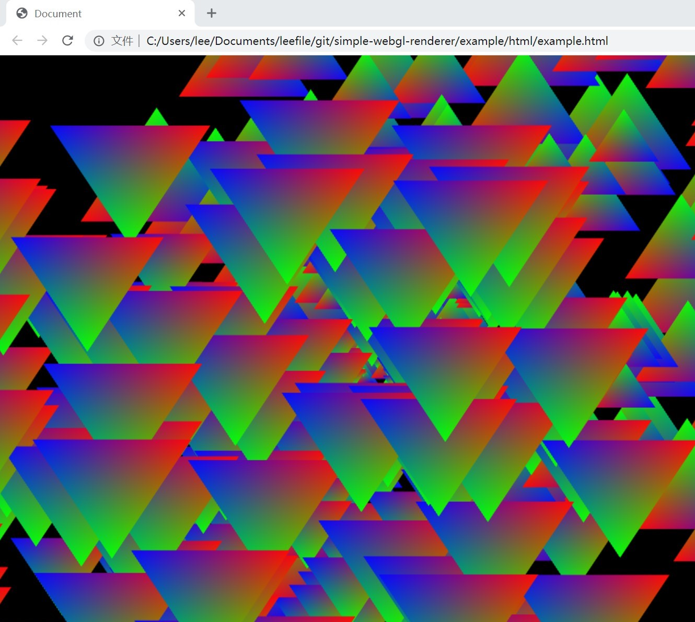
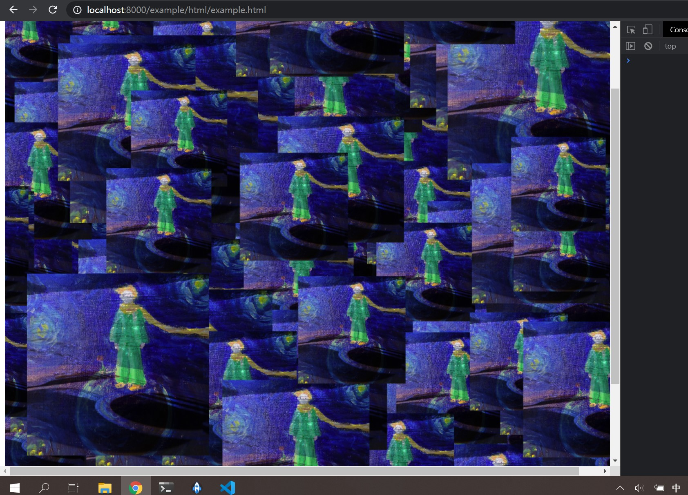

# simpleWebglRenderer
a simple webGL renderer.

##  example
1. build examples:
```
npm run buildExample
```
2. start a static http server, (I use python http server)
```
python http.server
```
3. open example/html/example.html in http server





